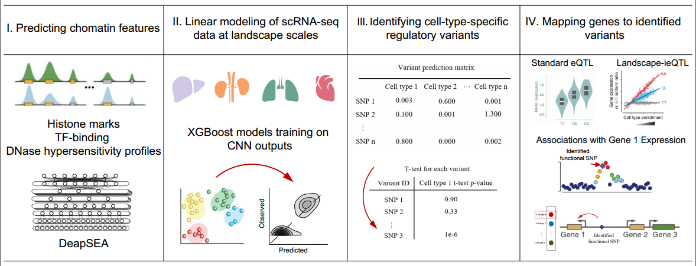

# Huatuo
Huatuo is an analytical framework for systematically exploring genetic variation of gene regulation at cell-type and single-nucleotide resolutions. It integrates variant effect predictions in specific cellular context from deep learning-based models with expression quantitative trait loci from population-based association analyses, thus allowing us to disentangle causality for complicated genetic regulation and seek independent statistical support for *de novo* predictions of variant effects. As whole-genome sequencing datasets grow in volume, we expect Huatuo will have great promise for identifying contribution of noncoding variants to diseases, uncovering novel disease-causal genes and shedding light on the cellular process critical for disease progression.

<div align=center>  </div> 

<p align="center">Schematic view of Huatuo</p>  

## Requirements
- R packages
```
> argparser
> dplyr
> data.table
> readr
```
- Python packages
```
> h5py >= 2.7.0
> numpy >= 1.14.2
> pandas == 0.22.0
> scipy >= 0.19.1
> six >= 1.11.0
> xgboost == 0.7.post4
> pyfasta >= 0.5.2
> torch >= 1.0.0
> argparse
```
- Other tools
```
> plink
> liftOver
```
## Tutorial
The script `Huatuo.sh` shows how to identify putative cell-type-specific regulatory variants and the associated gene regulation for an arbitrary set of variants users are interested in. For example, you can input a set of significant GWAS SNPs and explore the candidate causal variants, functional genes as well as the cell types underlying a specific complex trait or disease.

The output of the procedure is *de novo* predicted cell-type-specific functional variants and putative variant-gene links inferred from landscape-ieQTLs (landscape-ieQTLs are genetic loci with a cell-type-dependent genetic regulatory effect calculated from population-based association tests). The output files will be created in the `result/de_novo_predictions` and `result` directory, named as `predicted_cell_specific_functional_variant.txt` and `cell_type_specific_gene_regulation.txt`, respectively. 

Note that the framework is originally developed from single-cell transcriptome data in Human Cell Landscape (HCL). Thus, by default, the generated results are computed based on the gene expression profiles of 357 HCL cell clusters that are further divided into 44 major cell types according to corresponding cell annotations. 

**Example:**
```
./script/Huatuo.sh --input_variant_file example_data/input_variant.txt
```

## FAQs
**Can I perform Huatuo analysis with other scRNA-seq data instead of HCL datasets?**

**A:** We provide chromatin features of each 200-bp bin around ± the 20 kb genome regions centered on transcription start sites (TSSs) of each gene, which were predicted from a convolutional neural network (CNN) model, DeepSEA. This file `features.npz` can be downloaded [here](http://bis.zju.edu.cn/huatuo/). Based on it, you can train XGBoost prediction models for your own cell types by using prepared gene expression data and following train.py under the script directory.

The gene expression profiles used for training can be generated from single-cell transcriptome data by aggregating the average data from multiple cells in the same cell cluster. We suggest performing the Markov affinity-based graph imputation of cells (MAGIC) algorithm for imputation of the normalized single-cell expression matrix before cellular aggregation.

Once all XGBoost regression models are trained, you can type the commands to explore the variant regulatory effects within specific cellular contexts:

```
./script/Huatuo.sh --input_variant_file input_variant.txt \
         --anno_file cell_cluster_annatation.txt \
         --XGBoost_modelslist XGBoost_modelslist
```

`--anno_file`: the first column is the cell cluster names matched to the XGBoost prediction models, and the second column is major cell type annotations the cell clusters belong. 

`--XGBoost_modelslist`: a tab-delimited text file defining the paths to your trained XGBoost models. The format can be referred to the file HCL_XGBoost_modelslist under the data directory. 

